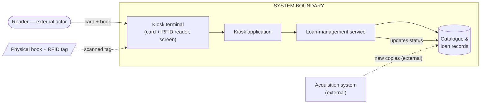
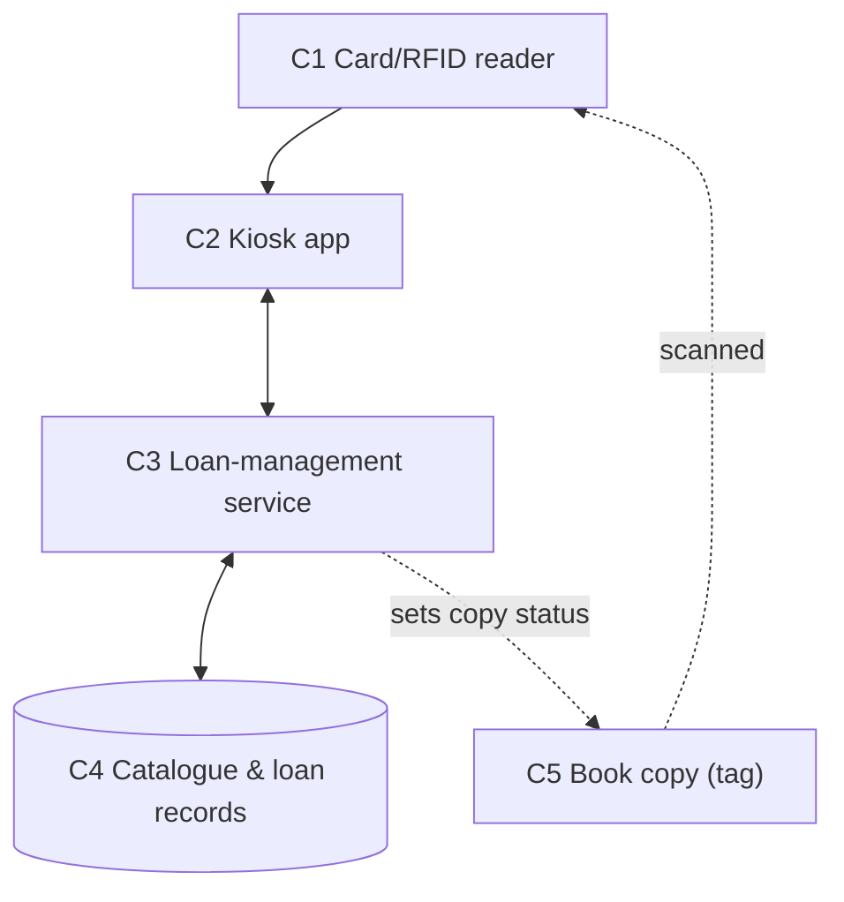
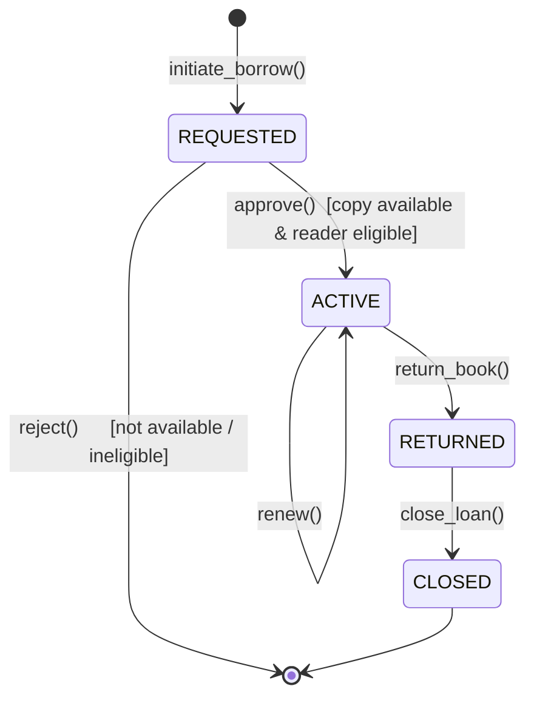
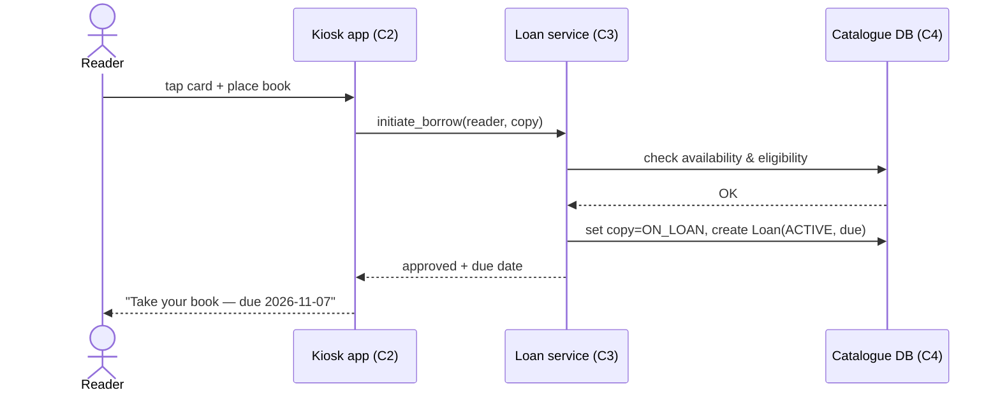
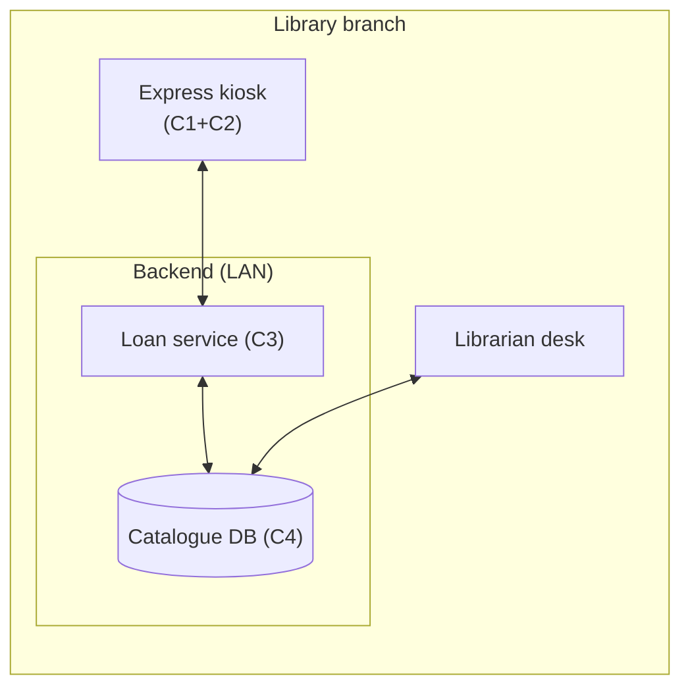
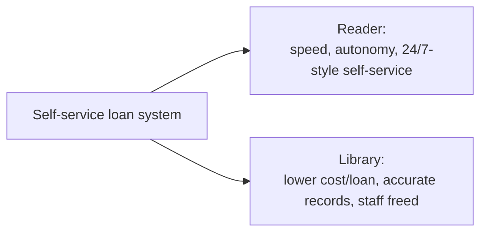
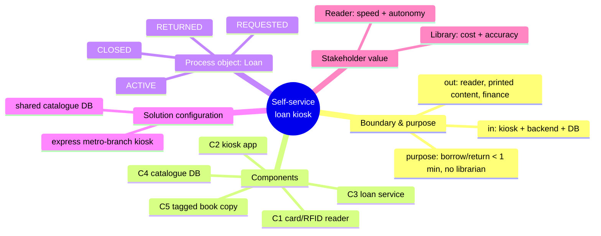

# SSE Task 1 — Model System: Basic Concepts

**Subject:** Soft Engineering
**Course:** 2026 HR S5 Soft Engineering
**Task id:** `sse-task-1-model-system-basic-concepts`

---

## 1. Task statement (as given)

> Select one system you use daily and model the five basic concepts.
> Define:
> - System boundary and purpose
> - 3–5 components
> - one process object + initial / final states + 2–4 operations
> - one solution configuration that uses the system
> - value for two stakeholders

## 2. Chosen system

**A city public-library self-service book-loan system** — the machine + software the reader
uses to borrow and return a physical book without a librarian.

Why this system: it is used daily, it has a clean, visible boundary (the kiosk + the catalogue
backend it talks to), and it naturally exposes all five basic modelling concepts — a boundary
and purpose, several components, a process object with states and operations, a concrete
solution configuration, and clearly separable stakeholder value.

The model is expressed with the standard systems-engineering vocabulary used in the course:
**system, boundary, purpose, component, process object, state, operation, solution
configuration, stakeholder, value.**

---

## 3. Basic concept 1 — System boundary and purpose

**Boundary.** The system *is* the self-service loan kiosk together with the loan-management
backend it owns:

```
IN scope (inside the boundary)
  • RFID/library-card reader at the kiosk
  • kiosk touchscreen application
  • loan-management service (business logic)
  • loan catalogue / loan-records database
  • book tag (RFID) — part of the object-managed side

OUT of scope (outside the boundary)
  • the reader (the human actor — a stakeholder, not a component)
  • the physical book as printed content (only its identity/tag is modelled)
  • the library's acquisition/budget system
  • payment/banking rails (only a fine *amount* is produced; collection is external)
```

**Purpose.** *Enable a registered reader to borrow or return a book in under a minute,
keeping the loan record accurate and the copy's availability up to date — without a
librarian.*

**Boundary diagram**



---

## 4. Basic concept 2 — 3–5 components

| # | Component | Responsibility (function) |
|---|---|---|
| C1 | **Card & RFID reader** | Identifies the reader (library card) and the book (RFID tag); converts physical identity → digital identifiers. |
| C2 | **Kiosk application (UI)** | Guides the user through borrow/return; renders prompts, errors, and receipts. |
| C3 | **Loan-management service** | Enforces the business rules: is the book available? is the reader allowed? compute due date, detect overdue/fines. |
| C4 | **Catalogue & loan-records database** | Stores authoritative state: which copy is where, who holds what, due dates. |
| C5 | **Book copy (tagged item)** | The managed physical object; carries the RFID tag that binds it to a catalogue record. |

Component interaction:



---

## 5. Basic concept 3 — Process object: states and operations

**Process object: a *Loan*.**

A *Loan* is the entity that lives through the borrow cycle and whose state the system tracks.

**States**

| State | Meaning |
|---|---|
| `REQUESTED` (initial) | Reader identified, a specific copy is selected, checks are running. |
| `ACTIVE` | Copy handed over, due date set, copy marked *on loan*. |
| `RETURNED` | Copy checked back in, availability restored. |
| `CLOSED` (final) | Loan archived; no fine, or fine recorded and handed to the billing/finance side. |

**State machine**



**Operations (4)**

| Operation | Trigger | Effect on state | Notes |
|---|---|---|---|
| `initiate_borrow(reader, copy)` | reader taps card + book | → `REQUESTED` | reads identities |
| `approve()` | availability + eligibility OK | `REQUESTED` → `ACTIVE` | sets due date, marks copy *on loan* |
| `return_book(copy)` | book placed on return pad | `ACTIVE` → `RETURNED` | marks copy *available*; computes overdue/fine |
| `renew()` / `close_loan()` | reader extends / closing | `ACTIVE`→`ACTIVE` / `RETURNED`→`CLOSED` | extend due date / archive loan |

Sequence of one borrow:



---

## 6. Basic concept 4 — One solution configuration

A **solution configuration** is a concrete, deployable arrangement of the system's
components that realises the purpose for a given setting.

**Configuration: "Metro-branch express kiosk"**

| Aspect | Setting |
|---|---|
| Deployment | One compact floor-standing kiosk at a library-branch entrance; screen + card reader + flat RFID pad on top. |
| Reader | Touch + card tap; no librarian, no queuing. |
| Service host | Loan-management service runs in the library's on-prem backend (single instance, LAN). |
| Data | Catalogue DB shared with the librarian desk, so both see the same loan state. |
| Network | Kiosk ↔ backend over the branch LAN; offline mode caches a read-only copy of the reader's active loans. |
| Concurrency | Multiple copies can be on loan at once; a copy is locked while a loan for it is `REQUESTED`. |

Deployment view:



**Why this configuration fits:** it puts the whole borrow cycle at the point of need (the
entrance), needs no librarian, and shares one source of truth with the desk, so
availability is never double-booked.

---

## 7. Basic concept 5 — Value for two stakeholders

| Stakeholder | Value delivered |
|---|---|
| **Reader (library user)** | Borrow/return in < 1 minute, any time the branch is open; no queue, no counter; instant confirmation and due date; self-service returns. |
| **Library (operations/branch manager)** | Librarian time freed from routine desk work; accurate, real-time loan records (fewer double-bookings and lost copies); lower operating cost per loan; usage data for acquisition decisions. |

Value flow:



---

## 8. Concept summary map



---

## 9. Deliverables in this folder

| Path | Content |
|---|---|
| `README.md` | This document — full model of the five basic concepts |
| `diagrams/boundary.mmd` | System boundary + purpose |
| `diagrams/components.mmd` | Component interaction |
| `diagrams/loan-states.mmd` | Loan state machine |
| `diagrams/borrow-sequence.mmd` | One borrow sequence |
| `diagrams/deployment.mmd` | Solution configuration (deployment) |
| `diagrams/value.mmd` | Stakeholder value flow |
| `diagrams/concept-map.mmd` | Mind-map summary of all five concepts |
| `assets/*.svg` | Rendered SVGs of the diagrams above |
| `tables/analysis.md` | The five concepts as compact reference tables |
| `code/loan_model.py` | Runnable Python model of the Loan state machine + borrow cycle |

## 10. Conclusion

Modelling the self-service loan kiosk through the five basic concepts yields a clean,
complete picture: a **bounded system with a clear purpose**, five **components** with single
responsibilities, a **process object (Loan)** whose **states and operations** describe the
borrow cycle, one deployable **solution configuration**, and measurable **value for two
stakeholders**. The same model is directly implementable (see `code/loan_model.py`).
