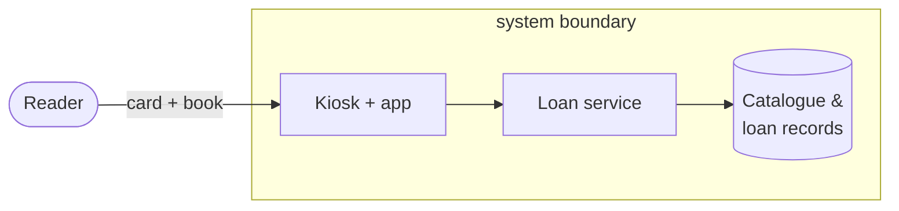
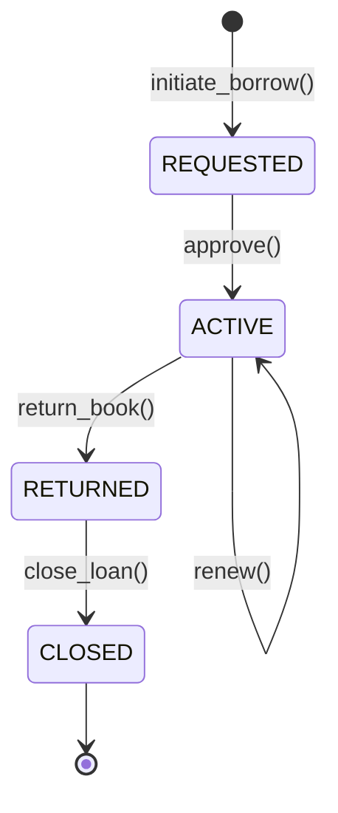

# SSE Task 1 — Model System: Basic Concepts

**Subject:** Soft Engineering · **Course:** 2026 HR S5 Soft Engineering

## Task

Select one system you use daily and model the five basic concepts: system boundary and
purpose; 3–5 components; one process object with initial/final states and 2–4 operations;
one solution configuration that uses the system; value for two stakeholders.

---

## The system

I chose the **self-service book-loan kiosk** at the city public library — the machine and
software that let me borrow and return a physical book without a librarian. I use it almost
every week.

### 1. System boundary and purpose

**Boundary.** The system is the kiosk plus the loan-management backend it owns. Inside: the
card/RFID reader, the kiosk app, the loan service, and the catalogue/loan database. Outside:
me (the reader), the printed book content, the library's acquisition system, and the payment
side.

**Purpose:** let a registered reader borrow or return a book in under a minute and keep the
loan records accurate and the copy availability up to date — without a librarian.

### 2. Components

| # | Component | Responsibility |
|---|---|---|
| C1 | Card & RFID reader | identifies the reader and the book |
| C2 | Kiosk application | guides the user, shows prompts and errors |
| C3 | Loan-management service | applies the rules: availability, eligibility, due date |
| C4 | Catalogue & loan-records DB | stores which copy is where and who holds what |
| C5 | Book copy (tagged) | the physical object being borrowed |

### 3. Process object — a Loan

A **Loan** is the object that moves through the borrow cycle.

- **States:** `REQUESTED` (initial) → `ACTIVE` → `RETURNED` → `CLOSED` (final).
- **Operations (4):** `initiate_borrow(reader, copy)`, `approve()`, `return_book(copy)`,
  `renew()` / `close_loan()`.

### 4. One solution configuration

A **"branch express kiosk"**: one floor-standing kiosk at the branch entrance (card reader
+ screen + RFID pad on top), talking over the branch LAN to the loan service and a catalogue
DB that is shared with the librarian desk — so both see the same loan state and a copy is
never double-booked.

### 5. Value for two stakeholders

| Stakeholder | Value |
|---|---|
| **Reader (me)** | borrow/return in under a minute, no queue, instant due date |
| **Library** | staff time freed from routine desk work, accurate real-time loan records, lower cost per loan |

---

## Conclusion

Modelling the kiosk with the five basic concepts gives a complete and simple picture: a
**bounded system with a clear purpose**, five **components**, a **process object (Loan)**
with its **states and operations**, one deployable **solution configuration**, and concrete
**value for two stakeholders**.
