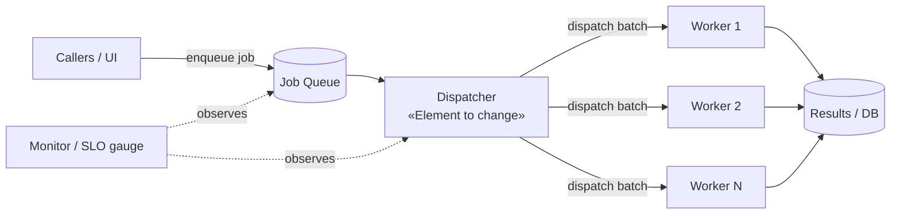

# SSE Task 11 — Contradiction

**Subject:** Soft Engineering
**Course:** 2026 HR S5 Soft Engineering
**Task id:** `sse-task-11-contradiction`

---

## 1. Task statement (as given)

> Select a software system and specify the goal of improvement.
> Identify the element that will be changed.
> Define the negative effect of this change.
> Formulate a contradiction in the format:
> "If we will **[change]**, then we **[desired effect]**, but this leads to **[undesired effect]**."

## 2. What "contradiction" means here (systems-engineering context)

This is a **TRIZ / systems-thinking contradiction** exercise. A contradiction appears when
improving one parameter of a system unavoidably worsens another parameter of the *same* system,
because the two parameters are coupled through a shared element.

Two standard formats are used in TRIZ:

| Format | Shape | Meaning |
|---|---|---|
| **Technical (TC)** | *If we [change], then [desired effect], but [undesired effect]* | One parameter improves, another degrades. |
| **Physical (PC)** | *Element X must be [property A] to achieve [goal] and must be [~A] to avoid [failure]* | A single element must carry two opposite properties at once. |

The task explicitly requires the **technical-contradiction** wording, so that is the primary
deliverable. A physical contradiction is derived as a follow-up, because the *device* used to
resolve a TC is normally to reformulate it into a PC and separate the opposite requirements in
**time, space, or scale** (TRIZ "separation principles", `diagrams/contradiction-map.mmd`).

## 3. Chosen system and goal of improvement

**Software system:** a **task/worker queue service** (job scheduler) of a typical backend —
e.g. the worker pool of a web application that processes asynchronous jobs (email sending,
image/video transcoding, report generation, third-party imports).

**Element to be changed:** the **scheduler's dispatch policy — specifically the number /
granularity of job batches that the dispatcher pushes to workers in a single cycle**
(i.e. the *batching* of the dispatch, a property of the *dispatcher* element).

**Goal of improvement:** raise **system throughput / reduce idle worker time** while keeping
the system responsive and safe under load — i.e. improve *speed of processing the queue*
without degrading *fairness/freshness of urgent jobs*.

### 3.1 System model (element view)



`diagrams/system-model.mmd` — source for the diagram above.

## 4. The change, the desired effect and the undesired effect

**Change:**
Increase the **batch size and batch size limit (max jobs handed to a worker per dispatch cycle)**,
so that workers receive more work per dispatch and context-switching/dispatch overhead falls.

**Desired effect:**
Fewer dispatch round-trips and less per-job bookkeeping ⇒ **higher throughput**; workers stay
busy instead of starving between dispatches; CPU/cache utilization improves.

**Undesired (negative) effect:**
Because batching pulls a **larger prefix of the queue** into a worker at once **and holds the
batch until it completes**, a **single slow or long-running job blocks the whole batch** and
**new, urgent, high-priority jobs wait behind already-dispatched jobs**. Result:
**latency / wait-time for a single job grows** (head-of-line blocking) and the system becomes
**less fair and less responsive** under variable load.

## 5. Contradiction formulation

> **If we will increase the dispatch batch size (the number of jobs handed to a worker per
> dispatch cycle), then we will increase throughput and worker utilization, but this leads to
> an increase in per-job latency and head-of-line blocking for urgent jobs (loss of
> responsiveness and fairness).**

Compressed form:

> **If we will batch the dispatch more coarsely, then we will process more work per unit time,
> but this leads to worse worst-case latency and poorer priority fairness.**

### 5.1 Why it is a genuine contradiction

The two parameters (throughput, latency/fairness) are **not independently controllable** by
the chosen element: they are both functions of the *same* variable — batch size. Making the
dispatcher more efficient at handoff (bigger batches) is exactly what makes it less able to
react quickly (bigger inertia). There is no batch size that is simultaneously *large enough*
for peak throughput and *small enough* for minimal latency.

## 6. Physical contradiction (derived)

The technical contradiction above can be sharpened into a physical contradiction on the
**batch size of the dispatcher**:

> **The dispatch batch must be LARGE (many jobs per cycle) in order to reduce dispatch overhead
> and maximize throughput, AND the dispatch batch must be SMALL (few jobs per cycle) in order
> to minimize per-job latency and preserve responsiveness/fairness for urgent jobs.**

Same element (batch size), two opposite required values — the hallmark of a physical
contradiction. The next section shows how this PC is separated.

## 7. Resolving the contradiction (separation principles)

A good contradiction analysis does not stop at the statement — it shows *where* the opposite
demands can be **separated** so both goals are partly met (this is exactly the TRIZ technique
of "separation of contradictory requirements").

| Separation | How it is applied here |
|---|---|
| **In time** | Use **adaptive batching**: large batches during steady high-load periods, tiny batches (or batch=1) when the queue contains urgent/priority jobs or when load is low. Batch size changes over time. |
| **In space** | **Split the queue by class** (priority vs. bulk) and use different batch sizes per stream: bulk jobs get large batches, real-time/priority jobs get batch=1 with a separate fast lane. |
| **In scale** | Set a **soft cap with preemption**: a large batch may be *dispatched*, but individual items can be **preempted / yielded** mid-batch, so batch granularity is coarse at the dispatch level yet fine at the execution level. |
| **Condition / threshold** | Define an **SLA-driven rule**: batch size is a function of (queue depth, oldest-job age, job priority class) rather than a constant. |

### 7.1 Consistency and trade-off table

| Option | Throughput | Latency (urgent jobs) | Fairness | Complexity | Verdict |
|---|---|---|---|---|---|
| Small batches (batch = 1) | low | minimal | high | low | safe but slow |
| Large batches | high | high | low | low | fast but unresponsive |
| **Adaptive / priority-aware batching** | high | low–moderate | high | moderate | ✔ recommended resolution |

## 8. Deliverables map

| Artifact | Purpose |
|---|---|
| `README.md` (this file) | Full solution: system, element, effects, contradiction, resolution |
| `diagrams/system-model.mmd` | Element view of the queue service, marks the changed element |
| `diagrams/contradiction-map.mmd` | Cause→effect chain and the contradiction point |
| `diagrams/separation.mmd` | Separation-principle resolution tree |
| `assets/system-model.svg` | Rendered system model |
| `assets/contradiction-map.svg` | Rendered contradiction chain |
| `assets/separation.svg` | Rendered separation tree |
| `tables/analysis.md` | Standalone parameter / effect / contradiction tables |
| `code/dispatcher.py` | Minimal runnable demo of the batch-size contradiction |

## 9. Reproduce the diagrams

```bash
# from this folder
npx -y @mermaid-js/mermaid-cli -i diagrams/system-model.mmd -o assets/system-model.svg
npx -y @mermaid-js/mermaid-cli -i diagrams/contradiction-map.mmd -o assets/contradiction-map.svg
npx -y @mermaid-js/mermaid-cli -i diagrams/separation.mmd -o assets/separation.svg
```

Rendered SVGs are committed under `assets/` so the diagrams are visible on GitHub without
building anything.
